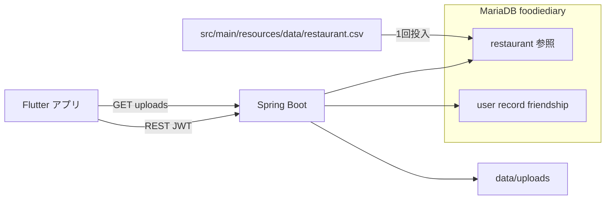

# 大東味地図 — 食べ記録 (Foodie Diary)

地図ベースの食事記録・共有モバイルサービス **「大東味地図 — 食べ記録」** の **Spring Boot バックエンド API** リポジトリです。  
クライアントは **Flutter** + **カカオマップ API** で別途開発・連携されています。

| 項目 | 内容 |
|------|------|
| 開発期間 | 2025年4月 — 2025年6月 |
| 科目 | 創造プロジェクト |
| データ | [全国一般飲食店標準データ](https://www.data.go.kr/data/15096283/standard.do) 精製版（リポジトリ同梱） |

---

## 概要

日常の食事や料理の写真がすぐに忘れ去られてしまう問題を、**位置・写真・レビューがひとつにまとまった「食べ記録」** で解決します。公共データに基づく **周辺の名店（半径1km、最大20件）** を検索したうえで記録を残し、**友だち・公開範囲** に応じて共有できます。

---

## 技術スタック

Java 21 · Spring Boot 3.4 · Spring Data JPA · MariaDB · JWT · **ローカルファイル保存**（デフォルト `local` プロファイル）· GeoTools（座標変換）· Gradle

---

## DB 構成

**MariaDB 1 台**（`foodiediary`）内でテーブルの役割のみ分けます。物理 DB は分離しません。**スキーマと参照データは固定**であり、今後の変更は前提としません。

| 区分 | テーブル | 性質 |
|------|--------|------|
| 参照（公共） | `restaurant` | 公共データ **精製 CSV** を起動時に **1 回投入**、参照専用 |
| アプリ | `user`, `record`, `record_image`, `friendship` | 会員・食べ記録・友だち、CRUD 対象 |

- **スキーマ**: JPA `ddl-auto: update` — エンティティに基づきテーブルを自動作成・更新
- **参照データ**: [`src/main/resources/data/restaurant.csv`](src/main/resources/data/restaurant.csv)（公共データ原典を精製・Git 同梱）。`restaurant` が空なら [`RestaurantCsvLoader`](src/main/java/foodiediary/restaurant/loader/RestaurantCsvLoader.java) が **1 回** DB に投入
- **バックアップ**: ポートフォリオデプロイ時はアプリテーブルを中心にバックアップ。`restaurant` は同梱 CSV または DB スナップショットで復元

---

## ローカル実行

### 1. 事前準備

- **Java 21**、**MariaDB**
- MariaDB に空のデータベースを作成（例: `CREATE DATABASE foodiediary CHARACTER SET utf8mb4;`）

### 2. 設定ファイル

| ファイル | 役割 |
|------|------|
| [`application.yml`](src/main/resources/application.yml) | DB 接続、JPA、CSV パス（デフォルトプロファイル: `jwt`, `local`） |
| [`application-local.yml`](src/main/resources/application-local.yml) | 画像保存パス・公開 URL（`local` プロファイル） |
| [`application-prod.yml`](src/main/resources/application-prod.yml) | ポートフォリオデプロイ用（`show-sql: false`） |

**入力項目（DB）**

| キー | 説明 |
|----|------|
| `spring.datasource.url` | 例: `jdbc:mariadb://localhost:3306/foodiediary` |
| `spring.datasource.username` | DB ユーザー |
| `spring.datasource.password` | DB パスワード |

**飲食店 CSV（参照データ、リポジトリ同梱）**

| キー | デフォルト値 | 説明 |
|----|--------|------|
| `app.restaurant.csv-path` | `classpath:data/restaurant.csv` | 精製 CSV パス（`classpath:` またはファイルパス） |
| `app.restaurant.batch-size` | `1000` | JDBC batch insert サイズ |

精製 CSV ファイル: [`src/main/resources/data/restaurant.csv`](src/main/resources/data/restaurant.csv)

- [全国一般飲食店標準データ](https://www.data.go.kr/data/15096283/standard.do) 原典から **アプリに必要な列のみ抽出・精製** し、リポジトリに含めます。
- 初回起動: Hibernate がテーブル作成 → `restaurant` が空なら CSV を **1 回** 投入
- **2 回目以降の起動** では投入を自動スキップ

CSV ファイルがまだない場合、アプリは起動しますが WARN ログが出力され、`/foodiediary/restaurant/nearby` は空配列を返します。精製 CSV を上記パスに追加し、DB を空にして再起動すると投入されます。

**CSV 列（ヘッダー名、大文字小文字・空白は無視）**

| DB 列 | 認識するヘッダー例 |
|---------|------------------|
| `id` | `번호`, `관리번호`, `id` |
| `business_name` | `사업장명`, `업소명` |
| `coord_x`, `coord_y` | `좌표정보X`, `좌표정보Y`（UTM-K） |
| `full_address` | `소재지전체주소`, `도로명전체주소`, `지번주소` |

**既にテーブルがある DB**

- `ddl-auto: update` でエンティティとスキーマの差分を自動反映します。
- `restaurant` にデータが既にあれば CSV ローダーは実行しません。

**画像保存（`local` プロファイル、デフォルト値）**

| キー | デフォルト値 | 説明 |
|----|--------|------|
| `storage.local.upload-dir` | `./data/uploads` | アップロードファイルディレクトリ（Git 除外） |
| `storage.local.public-base-url` | `http://localhost:8080` | クライアントに返す URL のプレフィックス |

- アップロード後の URL 例: `http://localhost:8080/uploads/{uuid}_{ファイル名}`
- `GET /uploads/**` で静的ファイルを提供（JWT 不要）

**S3（`aws` プロファイル、モック）**  
`--spring.profiles.active=jwt,aws` で起動すると、画像 API は `UnsupportedOperationException` を返します。実際の S3 連携は [`S3StorageService`](src/main/java/foodiediary/storage/S3StorageService.java) に今後実装できます。[`application-aws.yml`](src/main/resources/application-aws.yml) にはプレースホルダーのみ含まれています。

- デフォルトポート: **8080**、バインド: `0.0.0.0`
- 記録・画像アップロード: リクエストあたり最大 **10MB**、全体 **30MB**（`spring.servlet.multipart`）

**セキュリティ:** DB パスワードなどを記入した設定ファイルは **Git にコミットしないでください。**

### 3. 実行

```bash
./gradlew bootRun
```

Windows: `gradlew.bat bootRun`

起動後のデフォルト URL: `http://localhost:8080`

**ポートフォリオデプロイ例**

```bash
./gradlew bootRun --args='--spring.profiles.active=jwt,local,prod'
```

- JPA `ddl-auto: update`（エンティティ基準でテーブル作成）
- 精製 CSV は JAR に同梱されるため、別途ファイル配置は不要（`classpath:data/restaurant.csv`）
- `storage.local.public-base-url` を公開 URL に変更

---

## 認証（共通）

ほとんどの API では次のヘッダーが必要です。

```http
Authorization: Bearer {JWT}
```

**認証なしで呼び出し可能**

- `POST /foodiediary/user/login`
- `POST /foodiediary/user/signup`

ログイン成功時、レスポンス JSON の `token` 値を以降のリクエストで使用します。

---

## API の使い方

### ユーザー · 認証

#### 会員登録

```http
POST /foodiediary/user/signup
Content-Type: application/json
```

```json
{
  "id": "user01",
  "pw": "Pass1234!@",
  "name": "山田太郎",
  "phoneNum": "01012345678"
}
```

| ルール | 内容 |
|------|------|
| id | 15文字以下、英字+数字必須、`_` `.` 可 |
| pw | 10〜15文字、英字・数字・特殊文字を各1文字以上 |
| name | 15文字以下、ハングル・英字・数字 |
| phoneNum | 11桁の数字 |

- 成功: `200`（本文なし）
- 失敗: `400` + `{ "success": false, "message": "..." }`

#### ログイン

```http
POST /foodiediary/user/login
Content-Type: application/json
```

```json
{
  "id": "user01",
  "pw": "Pass1234!@#"
}
```

- 成功: `200` + `{ "token": "eyJ..." }`
- 失敗: `401` + `"로그인 실패: ..."`（ログイン失敗メッセージ）

#### 自分の情報取得

```http
GET /foodiediary/user/info
Authorization: Bearer {token}
```

- 成功: `200` + User エンティティ JSON（`id`, `pw`, `name`, `phoneNum`）

#### 自分の情報更新

```http
PATCH /foodiediary/user/info
Authorization: Bearer {token}
Content-Type: application/json
```

`id` はトークンから自動設定されます。変更するフィールドのみ送信します。

```json
{
  "name": "新しい名前",
  "pw": "NewPass1234!@",
  "phoneNum": "01098765432"
}
```

- 成功: `200`

---

### 飲食店（公共データ）

#### 周辺飲食店検索

現在地（WGS84 経緯度）を基準に **半径1km**、距離順 **最大20件**。

```http
GET /foodiediary/restaurant/nearby?longitude=127.0276&latitude=37.4979
Authorization: Bearer {token}
```

| クエリ | 説明 |
|------|------|
| longitude | 経度（WGS84） |
| latitude | 緯度（WGS84） |

レスポンス例（`200`、配列）:

```json
[
  {
    "id": 1,
    "businessName": "○○食堂",
    "longitude": 127.028,
    "latitude": 37.498,
    "fullAddress": "ソウル特別市 ..."
  }
]
```

---

### 食べ記録

公開範囲 `visibility`: `PUBLIC` | `FRIEND` | `PRIVATE`  
画像は記録あたり **最大3枚**。

#### 記録作成

```http
POST /foodiediary/record/write
Authorization: Bearer {token}
Content-Type: multipart/form-data
```

| フィールド（form） | 必須 | 説明 |
|-------------|------|------|
| title | ○ | タイトル |
| description | ○ | 説明 |
| coordinate_x | ○ | 緯度などの座標（BigDecimal） |
| coordinate_y | ○ | 経度などの座標（BigDecimal） |
| date | ○ | `YYYY-MM-DD` |
| authorId | ○ | 作成者 user id |
| visibility | ○ | `PUBLIC` / `FRIEND` / `PRIVATE` |
| images | × | 画像ファイル（複数可、最大3枚） |

- 成功: `200` + 記録 ID（数値）

#### 記録更新

```http
PATCH /foodiediary/record/update
Authorization: Bearer {token}
Content-Type: multipart/form-data
```

| フィールド | 必須 | 説明 |
|------|------|------|
| id | ○ | 記録 ID |
| title | × | |
| description | × | |
| visibility | × | |
| deleteImageUrls | × | 削除する画像 URL 一覧（`/uploads/` ローカル URL） |
| newImages | × | 追加画像（合計3枚を超え不可） |

- 成功: `200`

#### 記録削除

```http
DELETE /foodiediary/record/delete?id={recordId}
Authorization: Bearer {token}
```

- 成功: `200`

#### 記録フィルター検索

本人・友だちの記録のみ閲覧可能（権限に応じて `PRIVATE` などをフィルタリング）。

```http
GET /foodiediary/record/list?authorId={userId}&date=2025-06-01&coordinateX=37.5&coordinateY=127.0&title=名店&description=レビュー
Authorization: Bearer {token}
```

| クエリ | 説明 |
|------|------|
| authorId | 対象ユーザー（省略時は本人） |
| date | `YYYY-MM-DD` |
| coordinateX, coordinateY | 位置フィルター |
| title, description | 部分一致検索 |

- 成功: `200` + `RecordResponseDto[]`

#### 記録一覧（ページング）

1ページ **5件**、`pageNum` は **1から**。

```http
GET /foodiediary/record/page?pageNum=1
Authorization: Bearer {token}
```

友だちの記録:

```http
GET /foodiediary/record/page?authorId={friendId}&pageNum=1
Authorization: Bearer {token}
```

レスポンスフィールド: `id`, `title`, `description`, `coordinateX`, `coordinateY`, `date`, `author`, `visibility`, `like`, `imagePaths`

#### 記録いいね

```http
POST /foodiediary/record/like?recordId=1
Authorization: Bearer {token}
```

- 成功: `200` + `"좋아요 반영 성공"`（いいね反映成功）
- 失敗: `400` / `500`

#### 人気公開記録

`PUBLIC` 記録をいいね数順、1ページ5件。

```http
GET /foodiediary/record/popular?pageNum=1
Authorization: Bearer {token}
```

---

### 画像アップロード（ローカル保存）

記録作成時に `images` で一緒に送る方式以外の、単独アップロード API。デフォルトプロファイル `local` ではディスクに保存します。

```http
POST /foodiediary/upload
Authorization: Bearer {token}
Content-Type: multipart/form-data
```

| フィールド | 説明 |
|------|------|
| image | 単一ファイル |

- 成功: `200` + 公開 URL 文字列（例: `http://localhost:8080/uploads/...`）
- 参照: `GET /uploads/{fileName}`（認証不要）

---

### 友だち（`/friends`）

すべてのリクエストに `Authorization: Bearer {token}` が必要です。

#### 友だちリクエスト送信

```http
POST /friends/request
Content-Type: application/json
```

```json
{ "targetId": "friend01" }
```

- 成功: `200` + Friendship オブジェクト

#### 送信リクエスト取消

```http
DELETE /friends/requests/{targetId}/cancel
```

#### リクエスト承認 / 拒否

```http
POST /friends/requests/{requesterId}/accept
POST /friends/requests/{requesterId}/reject
```

#### 友だち削除

```http
DELETE /friends/{friendId}
```

#### 友だち一覧

```http
GET /friends
```

- 成功: `200` + `[{ "id", "otherId", "status", "createdAt" }, ...]`

#### 受信 / 送信リクエスト一覧

```http
GET /friends/requests/received
GET /friends/requests/sent
```

#### 友だち追加用ユーザー検索

すでに友だちまたは本人は除外されます。

```http
GET /friends/search?keyword=山
```

- 成功: `200` + `[{ "id", "name", "phoneNum" }, ...]`

---

## API 一覧

| メソッド | パス | 認証 |
|--------|------|------|
| POST | `/foodiediary/user/signup` | × |
| POST | `/foodiediary/user/login` | × |
| GET | `/foodiediary/user/info` | ○ |
| PATCH | `/foodiediary/user/info` | ○ |
| GET | `/foodiediary/restaurant/nearby` | ○ |
| POST | `/foodiediary/record/write` | ○ |
| PATCH | `/foodiediary/record/update` | ○ |
| DELETE | `/foodiediary/record/delete` | ○ |
| GET | `/foodiediary/record/list` | ○ |
| GET | `/foodiediary/record/page` | ○ |
| POST | `/foodiediary/record/like` | ○ |
| GET | `/foodiediary/record/popular` | ○ |
| POST | `/foodiediary/upload` | ○ |
| POST | `/friends/request` | ○ |
| DELETE | `/friends/requests/{targetId}/cancel` | ○ |
| POST | `/friends/requests/{requesterId}/accept` | ○ |
| POST | `/friends/requests/{requesterId}/reject` | ○ |
| DELETE | `/friends/{friendId}` | ○ |
| GET | `/friends` | ○ |
| GET | `/friends/requests/received` | ○ |
| GET | `/friends/requests/sent` | ○ |
| GET | `/friends/search` | ○ |

---

## アーキテクチャ



---

## 公共データ・座標

- **原典**: [全国一般飲食店標準データ](https://www.data.go.kr/data/15096283/standard.do)
- **精製版**: [`src/main/resources/data/restaurant.csv`](src/main/resources/data/restaurant.csv) — 不要な列・行を削除しリポジトリに同梱
- **投入**: 起動時に `restaurant` テーブルが空の場合のみ自動 1 回投入
- **座標**: CSV の UTM-K（EPSG:5174）を DB に保存。API 応答時に WGS84（EPSG:4326）へ変換（[`CoordinateConverter`](src/main/java/foodiediary/restaurant/CoordinateConverter.java)）
- **検索**: UTM-K 座標基準の半径 1km native query

---

## ライセンス・データ

- 飲食店データ: [公共データポータル](https://www.data.go.kr/data/15096283/standard.do) 原典を精製した [`restaurant.csv`](src/main/resources/data/restaurant.csv) を同梱 — 利用条件を遵守
- 本リポジトリは学習・ポートフォリオ目的のプロジェクト成果物です。
