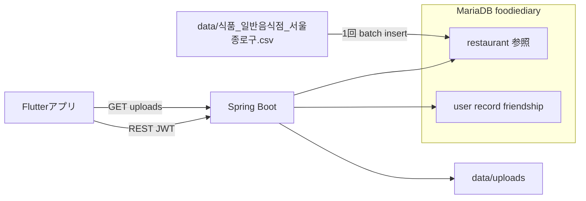

# 大東味地図 — 食べ記録 (Foodie Diary)

地図ベースの食事記録・共有モバイルサービス **「大東味地図 — 食べ記録」** の **Spring Boot バックエンド API** リポジトリです。  
クライアントは **Flutter** + **カカオマップ API** で別途開発・連携されています。


| 項目   | 内容                                                                                                    |
| ---- | ----------------------------------------------------------------------------------------------------- |
| 開発期間 | 2025年4月 — 2025年6月                                                                                     |
| 科目   | 創造プロジェクト                                                                                              |
| データ  | [全国一般飲食店標準データ](https://www.data.go.kr/data/15096283/standard.do) に基づく **ソウル鍾路区** 精製版（リポジトリ同梱、約6,400件） |


---

## 概要

日常の食事や料理写真が忘れられやすい課題を、**位置・写真・レビューがひとつになった「食べ記録」** で解決します。公共データに基づく **周辺の飲食店（半径1km、最大20件）** を検索したうえで記録を残し、**友だち・公開範囲** に応じて共有できます。

同梱の飲食店データは **ソウル特別市鍾路区** の一般飲食店のみです。鍾路区外の座標で `/foodiediary/restaurant/nearby` を呼び出すと、結果が空、または極めて少なくなる場合があります。

---

## 技術スタック

Java 21 · Spring Boot 3.4.5 · Spring Data JPA · MariaDB · JWT (jjwt) · **ローカルファイル保存**（デフォルト `local` プロファイル）· GeoTools 33.1（座標変換）· Gradle

---

## DB構成

**MariaDB 1つ**（`foodiediary`）にアプリ・参照テーブルをまとめます。

| 区分 | テーブル | 性質 |
|------|--------|------|
| 参照（公共） | `restaurant` | 同梱精製CSVを起動時に **1回だけ投入**、参照専用 |
| アプリ | `user`, `record`, `record_image`, `friendship` | 会員・食べ記録・友だち、CRUD対象 |

- **スキーマ**: JPA `ddl-auto: update` — エンティティに基づきテーブルを自動作成・更新
- **参照データ**: [`src/main/resources/data/식품_일반음식점_서울종로구.csv`](src/main/resources/data/식품_일반음식점_서울종로구.csv)。`restaurant` が空の場合、[`RestaurantCsvLoader`](src/main/java/foodiediary/restaurant/loader/RestaurantCsvLoader.java) が **1回** batch insert
- **バックアップ**: ポートフォリオデプロイ時はアプリテーブルを中心にバックアップ。`restaurant` は同梱CSVまたはDBスナップショットで復元

---

## 飲食店CSV投入

[全国一般飲食店標準データ](https://www.data.go.kr/data/15096283/standard.do) から **ソウル鍾路区** のみを抽出・精製したCSVをJARに同梱します。起動時に `restaurant` の行数が0の場合、UTF-8 CSVを読み **`restaurant` テーブルへ直接挿入** します（ステージング・原典39列の経路はありません）。

CSVパスは [`RestaurantCsvLoader.CSV_CLASSPATH`](src/main/java/foodiediary/restaurant/loader/RestaurantCsvLoader.java) に固定され、`application.yml` では変更しません。

**CSV列**（`restaurant` テーブルと同じ名前）

| CSVヘッダー | `restaurant` 列 | 説明 |
|----------|-------------------|------|
| `id` | `id` | 公共データの **管理番号** 文字列。投入時にMD5で正の整数PKへ変換（数字のみの場合はそのまま使用） |
| `business_name` | `business_name` | 店舗名 |
| `coord_x` | `coord_x` | UTM-K X（EPSG:5174） |
| `coord_y` | `coord_y` | UTM-K Y（EPSG:5174） |
| `full_address` | `full_address` | 地番・道路名住所 |

処理: [`RestaurantRefinedImporter`](src/main/java/foodiediary/restaurant/loader/RestaurantRefinedImporter.java) · batchサイズ: `app.restaurant.batch-size`（デフォルト `1000`）

- 投入失敗時は `restaurant` の **部分データを削除** します。
- **2回目以降の起動** は `restaurant` にデータがある場合、投入をスキップします。
- CSVがない場合は WARN ログの後、`/foodiediary/restaurant/nearby` は空配列を返します。

---

## ローカル実行

### 1. 事前準備

- **Java 21**
- **MariaDB**（ローカルインストールまたはDocker）

**MariaDBの起動（例）**

- Windows（サービス）: `net start MariaDB`（インストール時のサービス名に合わせて調整）
- Docker:

```bash
docker run -d --name foodiediary-mariadb -p 3306:3306 \
  -e MARIADB_ROOT_PASSWORD=root \
  -e MARIADB_DATABASE=foodiediary \
  mariadb:11
```

**空のデータベース作成**

クライアント（`mysql`、HeidiSQL、DBeaver など）で接続後:

```sql
CREATE DATABASE IF NOT EXISTS foodiediary CHARACTER SET utf8mb4 COLLATE utf8mb4_unicode_ci;
```

Docker例で `MARIADB_DATABASE=foodiediary` を指定した場合、DBは自動作成されます。

### 2. `application.yml` の修正

設定ファイル: [`src/main/resources/application.yml`](src/main/resources/application.yml)  
デフォルト有効プロファイル: `jwt`, `local`（`spring.profiles.include`）。

**ローカル環境に合わせて必ず変更する項目**

```yaml
spring:
  datasource:
    url: jdbc:mariadb://localhost:3306/foodiediary
    username: root          # 各自のDBユーザー
    password: root          # 各自のDBパスワード
```

| キー | 説明 |
|----|------|
| `spring.datasource.url` | ホスト・ポート・DB名（`foodiediary`） |
| `spring.datasource.username` | MariaDBユーザー |
| `spring.datasource.password` | MariaDBパスワード |

**任意設定**

| キー | デフォルト | 説明 |
|----|--------|------|
| `app.restaurant.batch-size` | `1000` | 飲食店CSVのJDBC batch insertサイズ |

**画像保存（`local` プロファイル）**


| キー                              | デフォルト                   | 説明                  |
| ------------------------------- | ----------------------- | ------------------- |
| `storage.local.upload-dir`      | `./data/uploads`        | アップロードディレクトリ（Git除外） |
| `storage.local.public-base-url` | `http://localhost:8080` | クライアントへ返すURLの接頭辞    |


- アップロード後のURL例: `http://localhost:8080/uploads/{uuid}_{ファイル名}`
- `GET /uploads/`** を静的配信（JWT不要）

**S3（`aws` プロファイル、モック）**  
`local` の代わりに `aws` を有効にすると、画像APIは `UnsupportedOperationException` を返します。実装は `[S3StorageService](src/main/java/foodiediary/storage/S3StorageService.java)` に追加でき、`application.yml` の `cloud.aws.`* はプレースホルダーです。

例: `./gradlew bootRun --args='--spring.profiles.active=jwt,aws'`

- デフォルトポート: **8080**、バインド: `0.0.0.0`
- 記録・画像: リクエストあたり最大 **10MB**、全体 **30MB**（`spring.servlet.multipart`）

**セキュリティ:** DBパスワード・JWTシークレットなどを記入した設定は **Gitにコミットしないでください。** JWTシークレットは現在 `[JwtFilter](src/main/java/foodiediary/security/JwtFilter.java)` / `[JwtProvider](src/main/java/foodiediary/security/JwtProvider.java)` にハードコードされているため、本番では環境変数・外部設定への分離を推奨します。

### 3. 実行

```bash
./gradlew bootRun
```

Windows: `gradlew.bat bootRun`

起動後: `http://localhost:8080`

**デプロイ時の参考**

- 精製CSVはJARに含まれるため、別途ファイル配置は不要
- `storage.local.public-base-url` を公開URLに変更
- SQLログ無効化の例: `--spring.jpa.show-sql=false`

---

## 認証（共通）

ほとんどのAPIでヘッダーが必要です。

```http
Authorization: Bearer {JWT}
```

**認証なしで呼び出し可能**

- `POST /foodiediary/user/login`
- `POST /foodiediary/user/signup`
- `GET /uploads/`**

ログイン成功時、レスポンスJSONの `token` を以降のリクエストで使用します。

---

## APIの使い方

### ユーザー · 認証

#### 会員登録

```http
POST /foodiediary/user/signup
Content-Type: application/json
```

```json
{
  "id": "user01",
  "pw": "Pass1234!@",
  "name": "홍길동",
  "phoneNum": "01012345678"
}
```


| ルール      | 内容                        |
| -------- | ------------------------- |
| id       | 15文字以下、英字+数字必須、`_` `.` 許可 |
| pw       | 10〜15文字、英字・数字・特殊文字を各1文字以上 |
| name     | ハングル・英字のみ（数字・特殊文字不可）      |
| phoneNum | 11桁の数字                    |


- 成功: `200`（本文なし）
- 失敗: `400` + `{ "success": false, "message": "..." }`

#### ログイン

```http
POST /foodiediary/user/login
Content-Type: application/json
```

```json
{
  "id": "user01",
  "pw": "Pass1234!@#"
}
```

- 成功: `200` + `{ "token": "eyJ..." }`
- 失敗: `401` + `"로그인 실패: 아이디 또는 비밀번호가 일치하지 않습니다"`

#### 自分の情報取得

```http
GET /foodiediary/user/info
Authorization: Bearer {token}
```

- 成功: `200` + UserエンティティJSON（`id`, `pw`, `name`, `phoneNum`）

#### 自分の情報更新

```http
PATCH /foodiediary/user/info
Authorization: Bearer {token}
Content-Type: application/json
```

`id` はトークンから自動設定されます。変更するフィールドのみ送信します。

```json
{
  "name": "새이름",
  "pw": "NewPass1234!@",
  "phoneNum": "01098765432"
}
```

- 成功: `200`

---

### 飲食店（公共データ）

#### 周辺飲食店検索

現在地（WGS84経緯度）を基準に **半径1km**、距離順 **最大20件**。DB座標（UTM-K）でnative query後、WGS84に変換して返します。

```http
GET /foodiediary/restaurant/nearby?longitude=127.0276&latitude=37.4979
Authorization: Bearer {token}
```


| クエリ       | 説明        |
| --------- | --------- |
| longitude | 経度（WGS84） |
| latitude  | 緯度（WGS84） |


レスポンス例（`200`、配列）:

```json
[
  {
    "id": 1,
    "businessName": "○○식당",
    "longitude": 127.028,
    "latitude": 37.498,
    "fullAddress": "서울특별시 종로구 ..."
  }
]
```

---

### 食べ記録

公開範囲 `visibility`: `PUBLIC` | `FRIEND` | `PRIVATE`  
画像は記録あたり **最大3枚**。

#### 記録作成

```http
POST /foodiediary/record/write
Authorization: Bearer {token}
Content-Type: multipart/form-data
```


| フィールド（form）  | 必須  | 説明                              |
| ------------ | --- | ------------------------------- |
| title        | O   | タイトル                            |
| description  | O   | 説明                              |
| coordinate_x | O   | 座標（BigDecimal）                  |
| coordinate_y | O   | 座標（BigDecimal）                  |
| date         | O   | `YYYY-MM-DD`                    |
| authorId     | O   | 作成者 user id                     |
| visibility   | O   | `PUBLIC` / `FRIEND` / `PRIVATE` |
| images       | X   | 画像ファイル（複数可、最大3枚）                |


- 成功: `200` + 記録ID（数値）

#### 記録更新

```http
PATCH /foodiediary/record/update
Authorization: Bearer {token}
Content-Type: multipart/form-data
```


| フィールド           | 必須  | 説明                               |
| --------------- | --- | -------------------------------- |
| id              | O   | 記録ID                             |
| title           | X   |                                  |
| description     | X   |                                  |
| visibility      | X   |                                  |
| deleteImageUrls | X   | 削除する画像URL一覧（`/uploads/` ローカルURL） |
| newImages       | X   | 追加画像（合計3枚超過不可）                   |


- 成功: `200`

#### 記録削除

```http
DELETE /foodiediary/record/delete?id={recordId}
Authorization: Bearer {token}
```

- 成功: `200`

#### 記録フィルタ検索

本人・友だちの記録のみ取得可能（権限に応じ `PRIVATE` などをフィルタ）。

```http
GET /foodiediary/record/list?authorId={userId}&date=2025-06-01&coordinateX=37.5&coordinateY=127.0&title=맛집&description=후기
Authorization: Bearer {token}
```


| クエリ                      | 説明             |
| ------------------------ | -------------- |
| authorId                 | 対象ユーザー（省略時は本人） |
| date                     | `YYYY-MM-DD`   |
| coordinateX, coordinateY | 位置フィルタ         |
| title, description       | 部分検索           |


- 成功: `200` + `RecordResponseDto[]`

#### 記録一覧（ページ）

1ページ **5件**、`pageNum` は **1から**（省略時は1）。

```http
GET /foodiediary/record/page?pageNum=1
Authorization: Bearer {token}
```

友だちの記録:

```http
GET /foodiediary/record/page?authorId={friendId}&pageNum=1
Authorization: Bearer {token}
```

レスポンスフィールド: `id`, `title`, `description`, `coordinateX`, `coordinateY`, `date`, `author`, `visibility`, `like`, `imagePaths`

#### 記録いいね

```http
POST /foodiediary/record/like?recordId=1
Authorization: Bearer {token}
```

- 成功: `200` + `"좋아요 반영 성공"`
- 失敗: `400` / `500`

#### 人気の公開記録

`PUBLIC` 記録をいいね順、1ページ5件。

```http
GET /foodiediary/record/popular?pageNum=1
Authorization: Bearer {token}
```

---

### 画像アップロード（ローカル保存）

記録作成時の `images` 送信に加え、単独アップロードAPI。

```http
POST /foodiediary/upload
Authorization: Bearer {token}
Content-Type: multipart/form-data
```


| フィールド | 説明     |
| ----- | ------ |
| image | 単一ファイル |


- 成功: `200` + 公開URL文字列（例: `http://localhost:8080/uploads/...`）
- 参照: `GET /uploads/{fileName}`（認証不要）

---

### 友だち（`/friends`）

すべてのリクエストに `Authorization: Bearer {token}` が必要です。

#### 友だちリクエスト送信

```http
POST /friends/request
Content-Type: application/json
```

```json
{ "targetId": "friend01" }
```

- 成功: `200` + Friendshipオブジェクト

#### 送信リクエスト取消

```http
DELETE /friends/requests/{targetId}/cancel
```

#### リクエスト承認 / 拒否

```http
POST /friends/requests/{requesterId}/accept
POST /friends/requests/{requesterId}/reject
```

#### 友だち削除

```http
DELETE /friends/{friendId}
```

#### 友だち一覧

```http
GET /friends
```

- 成功: `200` + `[{ "id", "otherId", "status", "createdAt" }, ...]`

#### 受信 / 送信リクエスト一覧

```http
GET /friends/requests/received
GET /friends/requests/sent
```

#### 友だち追加用ユーザー検索

すでに友だち、または本人は除外。

```http
GET /friends/search?keyword=홍
```

- 成功: `200` + `[{ "id", "name", "phoneNum" }, ...]`

---

## API一覧


| メソッド   | パス                                       | 認証  |
| ------ | ---------------------------------------- | --- |
| POST   | `/foodiediary/user/signup`               | X   |
| POST   | `/foodiediary/user/login`                | X   |
| GET    | `/foodiediary/user/info`                 | O   |
| PATCH  | `/foodiediary/user/info`                 | O   |
| GET    | `/foodiediary/restaurant/nearby`         | O   |
| POST   | `/foodiediary/record/write`              | O   |
| PATCH  | `/foodiediary/record/update`             | O   |
| DELETE | `/foodiediary/record/delete`             | O   |
| GET    | `/foodiediary/record/list`               | O   |
| GET    | `/foodiediary/record/page`               | O   |
| POST   | `/foodiediary/record/like`               | O   |
| GET    | `/foodiediary/record/popular`            | O   |
| POST   | `/foodiediary/upload`                    | O   |
| POST   | `/friends/request`                       | O   |
| DELETE | `/friends/requests/{targetId}/cancel`    | O   |
| POST   | `/friends/requests/{requesterId}/accept` | O   |
| POST   | `/friends/requests/{requesterId}/reject` | O   |
| DELETE | `/friends/{friendId}`                    | O   |
| GET    | `/friends`                               | O   |
| GET    | `/friends/requests/received`             | O   |
| GET    | `/friends/requests/sent`                 | O   |
| GET    | `/friends/search`                        | O   |


---

## アーキテクチャ



---

## 公共データ・座標

- **原典**: [全国一般飲食店標準データ](https://www.data.go.kr/data/15096283/standard.do)
- **同梱精製版**: [`식품_일반음식점_서울종로구.csv`](src/main/resources/data/식품_일반음식점_서울종로구.csv) — 鍾路区・`restaurant` 列名と同一の5列（UTF-8）
- **投入**: `restaurant` が空のときのみ自動1回（[`RestaurantCsvLoader`](src/main/java/foodiediary/restaurant/loader/RestaurantCsvLoader.java)）
- **座標**: CSVのUTM-K（EPSG:5174）をDBに保存。API応答時にWGS84（EPSG:4326）へ変換（[`CoordinateConverter`](src/main/java/foodiediary/restaurant/CoordinateConverter.java)）
- **検索**: UTM-K基準で半径1kmのnative query、最大20件

---

## ライセンス・データ

- 飲食店データ: [公共データポータル](https://www.data.go.kr/data/15096283/standard.do) 原典を精製したCSVを同梱 — 利用条件を遵守
- 本リポジトリは学習・ポートフォリオ目的のプロジェクト成果物です。

