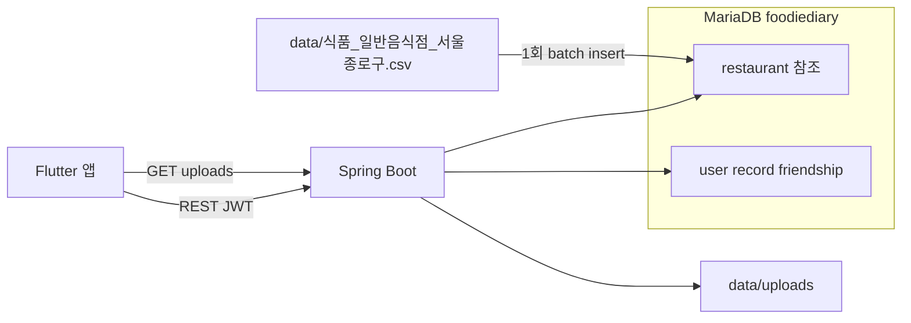

# 대동맛지도 — 먹기록 (Foodie Diary)

지도 기반 식사 기록·공유 모바일 서비스 **「대동맛지도 — 먹기록」**의 **Spring Boot 백엔드 API** 저장소입니다.  
클라이언트는 **Flutter** + **카카오맵 API**로 별도 개발·연동되었습니다.

| 항목 | 내용 |
|------|------|
| 개발 기간 | 2025년 4월 — 2025년 6월 |
| 과목 | 창의프로젝트 |
| 데이터 | [전국일반음식점표준데이터](https://www.data.go.kr/data/15096283/standard.do) 기반 **서울 종로구** 정제본 (저장소 포함, 약 6,400건) |

---

## 소개

일상 식사와 음식 사진이 쉽게 잊히는 문제를, **위치·사진·후기가 묶인 「먹기록」**으로 해결합니다. 공공데이터 기반 **주변 맛집(반경 1km, 최대 20곳)** 조회 후 기록을 남기고, **친구·공개 범위**에 따라 공유할 수 있습니다.

포함된 음식점 데이터는 **서울특별시 종로구** 일반음식점만 다룹니다. 종로구 밖 좌표로 `/foodiediary/restaurant/nearby`를 호출하면 결과가 없거나 매우 적을 수 있습니다.

---

## 기술 스택

Java 21 · Spring Boot 3.4.5 · Spring Data JPA · MariaDB · JWT (jjwt) · **로컬 파일 저장** (기본 `local` 프로필) · GeoTools 33.1 (좌표 변환) · Gradle

---

## DB 구성

**MariaDB 1개**(`foodiediary`)에 앱·참조 테이블을 함께 둡니다.

| 구분 | 테이블 | 성격 |
|------|--------|------|
| 참조(공공) | `restaurant` | 동봉 정제 CSV를 기동 시 **1회 적재**, 조회 전용 |
| 앱 | `user`, `record`, `record_image`, `friendship` | 회원·먹기록·친구, CRUD 대상 |

- **스키마**: JPA `ddl-auto: update` — 엔티티 기준으로 테이블 자동 생성·갱신
- **참조 데이터**: [`src/main/resources/data/식품_일반음식점_서울종로구.csv`](src/main/resources/data/식품_일반음식점_서울종로구.csv). `restaurant`가 비어 있으면 [`RestaurantCsvLoader`](src/main/java/foodiediary/restaurant/loader/RestaurantCsvLoader.java)가 **1회** batch insert
- **백업**: 포트폴리오 배포 시 앱 테이블 위주로 백업. `restaurant`는 동봉 CSV 또는 DB 스냅샷으로 복원

---

## 음식점 CSV 적재

[전국일반음식점표준데이터](https://www.data.go.kr/data/15096283/standard.do)를 **서울 종로구**만 추출·정제한 CSV를 JAR에 동봉합니다. 기동 시 `restaurant` 행 수가 0이면 UTF-8 CSV를 읽어 **`restaurant` 테이블에 바로 삽입**합니다 (스테이징·원본 39컬럼 경로 없음).

CSV 경로는 [`RestaurantCsvLoader.CSV_CLASSPATH`](src/main/java/foodiediary/restaurant/loader/RestaurantCsvLoader.java)에 고정되어 있으며, `application.yml`에서 바꾸지 않습니다.

**CSV 컬럼** (`restaurant` 테이블과 동일한 이름)

| CSV 헤더 | `restaurant` 컬럼 | 설명 |
|----------|-------------------|------|
| `id` | `id` | 공공데이터 **관리번호** 문자열. 적재 시 MD5로 양수 정수 PK로 변환 (이미 숫자만이면 그대로 사용) |
| `business_name` | `business_name` | 사업장명 |
| `coord_x` | `coord_x` | UTM-K X (EPSG:5174) |
| `coord_y` | `coord_y` | UTM-K Y (EPSG:5174) |
| `full_address` | `full_address` | 지번·도로명 주소 |

처리: [`RestaurantRefinedImporter`](src/main/java/foodiediary/restaurant/loader/RestaurantRefinedImporter.java) · batch 크기: `app.restaurant.batch-size` (기본 `1000`)

- 적재 실패 시 `restaurant`의 **부분 데이터는 삭제**됩니다.
- **두 번째 기동부터** `restaurant`에 데이터가 있으면 적재를 건너뜁니다.
- CSV가 없으면 WARN 로그 후 `/foodiediary/restaurant/nearby`는 빈 배열을 반환합니다.

---

## 로컬 실행

### 1. 사전 준비

- **Java 21**
- **MariaDB** (로컬 설치 또는 Docker)

**MariaDB 기동 (예시)**

- Windows(서비스): `net start MariaDB` (설치 시 등록된 서비스명에 맞게 조정)
- Docker:

```bash
docker run -d --name foodiediary-mariadb -p 3306:3306 \
  -e MARIADB_ROOT_PASSWORD=root \
  -e MARIADB_DATABASE=foodiediary \
  mariadb:11
```

**빈 데이터베이스 생성**

클라이언트(`mysql`, HeidiSQL, DBeaver 등)로 접속한 뒤:

```sql
CREATE DATABASE IF NOT EXISTS foodiediary CHARACTER SET utf8mb4 COLLATE utf8mb4_unicode_ci;
```

Docker 예시에서 `MARIADB_DATABASE=foodiediary`를 쓰면 DB는 이미 생성됩니다.

### 2. `application.yml` 수정

설정 파일: [`src/main/resources/application.yml`](src/main/resources/application.yml)  
기본 활성 프로필: `jwt`, `local` (`spring.profiles.include`).

**반드시 로컬 환경에 맞게 수정할 항목**

```yaml
spring:
  datasource:
    url: jdbc:mariadb://localhost:3306/foodiediary
    username: root          # 본인 DB 사용자
    password: root          # 본인 DB 비밀번호
```

| 키 | 설명 |
|----|------|
| `spring.datasource.url` | 호스트·포트·DB명 (`foodiediary`) |
| `spring.datasource.username` | MariaDB 사용자 |
| `spring.datasource.password` | MariaDB 비밀번호 |

**선택 설정**

| 키 | 기본값 | 설명 |
|----|--------|------|
| `app.restaurant.batch-size` | `1000` | 음식점 CSV JDBC batch insert 크기 |

**이미지 저장 (`local` 프로필)**

| 키 | 기본값 | 설명 |
|----|--------|------|
| `storage.local.upload-dir` | `./data/uploads` | 업로드 디렉터리 (Git 제외) |
| `storage.local.public-base-url` | `http://localhost:8080` | 클라이언트에 반환할 URL 접두사 |

- 업로드 후 URL 예: `http://localhost:8080/uploads/{uuid}_{파일명}`
- `GET /uploads/**` 정적 제공 (JWT 불필요)

**S3 (`aws` 프로필, 목업)**  
`local` 대신 `aws`를 활성화하면 이미지 API는 `UnsupportedOperationException`을 반환합니다. 실제 연동은 [`S3StorageService`](src/main/java/foodiediary/storage/S3StorageService.java)에 구현할 수 있으며, `application.yml`의 `cloud.aws.*`는 placeholder입니다.

예: `./gradlew bootRun --args='--spring.profiles.active=jwt,aws'`

- 기본 포트: **8080**, 바인딩: `0.0.0.0`
- 기록·이미지: 요청당 최대 **10MB**, 전체 **30MB** (`spring.servlet.multipart`)

**보안:** DB 비밀번호·JWT 시크릿 등을 채운 설정은 **Git에 커밋하지 마세요.** JWT 시크릿은 현재 [`JwtFilter`](src/main/java/foodiediary/security/JwtFilter.java) / [`JwtProvider`](src/main/java/foodiediary/security/JwtProvider.java)에 하드코딩되어 있으므로, 배포 시 환경 변수·외부 설정으로 분리하는 것을 권장합니다.

### 3. 실행

```bash
./gradlew bootRun
```

Windows: `gradlew.bat bootRun`

기동 후: `http://localhost:8080`

**배포 시 참고**

- 정제 CSV는 JAR에 포함되므로 별도 파일 배치 불필요
- `storage.local.public-base-url`을 공개 URL로 변경
- SQL 로그 비활성화 예: `--spring.jpa.show-sql=false`

---

## 인증 (공통)

대부분의 API는 헤더가 필요합니다.

```http
Authorization: Bearer {JWT}
```

**인증 없이 호출 가능**

- `POST /foodiediary/user/login`
- `POST /foodiediary/user/signup`
- `GET /uploads/**`

로그인 성공 시 응답 JSON의 `token` 값을 이후 요청에 사용합니다.

---

## API 사용 방법

### 사용자 · 인증

#### 회원가입

```http
POST /foodiediary/user/signup
Content-Type: application/json
```

```json
{
  "id": "user01",
  "pw": "Pass1234!@",
  "name": "홍길동",
  "phoneNum": "01012345678"
}
```

| 규칙 | 내용 |
|------|------|
| id | 15자 이하, 영문+숫자 필수, `_` `.` 허용 |
| pw | 10~15자, 영문·숫자·특수문자 각 1개 이상 |
| name | 한글·영문만 (숫자·특수문자 불가) |
| phoneNum | 11자리 숫자 |

- 성공: `200` (본문 없음)
- 실패: `400` + `{ "success": false, "message": "..." }`

#### 로그인

```http
POST /foodiediary/user/login
Content-Type: application/json
```

```json
{
  "id": "user01",
  "pw": "Pass1234!@#"
}
```

- 성공: `200` + `{ "token": "eyJ..." }`
- 실패: `401` + `"로그인 실패: 아이디 또는 비밀번호가 일치하지 않습니다"`

#### 내 정보 조회

```http
GET /foodiediary/user/info
Authorization: Bearer {token}
```

- 성공: `200` + User 엔티티 JSON (`id`, `pw`, `name`, `phoneNum`)

#### 내 정보 수정

```http
PATCH /foodiediary/user/info
Authorization: Bearer {token}
Content-Type: application/json
```

`id`는 토큰에서 자동 설정됩니다. 변경할 필드만 보냅니다.

```json
{
  "name": "새이름",
  "pw": "NewPass1234!@",
  "phoneNum": "01098765432"
}
```

- 성공: `200`

---

### 음식점 (공공데이터)

#### 주변 음식점 조회

현재 위치(WGS84 경위도) 기준 **반경 1km**, 거리순 **최대 20곳**. DB 좌표(UTM-K) 기준 native query 후 WGS84로 변환해 반환합니다.

```http
GET /foodiediary/restaurant/nearby?longitude=127.0276&latitude=37.4979
Authorization: Bearer {token}
```

| 쿼리 | 설명 |
|------|------|
| longitude | 경도 (WGS84) |
| latitude | 위도 (WGS84) |

응답 예 (`200`, 배열):

```json
[
  {
    "id": 1,
    "businessName": "○○식당",
    "longitude": 127.028,
    "latitude": 37.498,
    "fullAddress": "서울특별시 종로구 ..."
  }
]
```

---

### 먹기록

공개 범위 `visibility`: `PUBLIC` | `FRIEND` | `PRIVATE`  
이미지는 기록당 **최대 3장**.

#### 기록 작성

```http
POST /foodiediary/record/write
Authorization: Bearer {token}
Content-Type: multipart/form-data
```

| 필드 (form) | 필수 | 설명 |
|-------------|------|------|
| title | O | 제목 |
| description | O | 설명 |
| coordinate_x | O | 좌표 (BigDecimal) |
| coordinate_y | O | 좌표 (BigDecimal) |
| date | O | `YYYY-MM-DD` |
| authorId | O | 작성자 user id |
| visibility | O | `PUBLIC` / `FRIEND` / `PRIVATE` |
| images | X | 이미지 파일 (복수 가능, 최대 3장) |

- 성공: `200` + 기록 ID (숫자)

#### 기록 수정

```http
PATCH /foodiediary/record/update
Authorization: Bearer {token}
Content-Type: multipart/form-data
```

| 필드 | 필수 | 설명 |
|------|------|------|
| id | O | 기록 ID |
| title | X | |
| description | X | |
| visibility | X | |
| deleteImageUrls | X | 삭제할 이미지 URL 목록 (`/uploads/` 로컬 URL) |
| newImages | X | 추가 이미지 (합계 3장 초과 불가) |

- 성공: `200`

#### 기록 삭제

```http
DELETE /foodiediary/record/delete?id={recordId}
Authorization: Bearer {token}
```

- 성공: `200`

#### 기록 필터 조회

본인·친구 기록만 조회 가능(권한에 따라 `PRIVATE` 등 필터링).

```http
GET /foodiediary/record/list?authorId={userId}&date=2025-06-01&coordinateX=37.5&coordinateY=127.0&title=맛집&description=후기
Authorization: Bearer {token}
```

| 쿼리 | 설명 |
|------|------|
| authorId | 대상 사용자 (생략 시 본인) |
| date | `YYYY-MM-DD` |
| coordinateX, coordinateY | 위치 필터 |
| title, description | 부분 검색 |

- 성공: `200` + `RecordResponseDto[]`

#### 기록 목록 (페이지)

한 페이지 **5건**, `pageNum`은 **1부터** (생략 시 1).

```http
GET /foodiediary/record/page?pageNum=1
Authorization: Bearer {token}
```

친구 기록:

```http
GET /foodiediary/record/page?authorId={friendId}&pageNum=1
Authorization: Bearer {token}
```

응답 필드: `id`, `title`, `description`, `coordinateX`, `coordinateY`, `date`, `author`, `visibility`, `like`, `imagePaths`

#### 기록 좋아요

```http
POST /foodiediary/record/like?recordId=1
Authorization: Bearer {token}
```

- 성공: `200` + `"좋아요 반영 성공"`
- 실패: `400` / `500`

#### 인기 공개 기록

`PUBLIC` 기록을 좋아요 순, 페이지당 5건.

```http
GET /foodiediary/record/popular?pageNum=1
Authorization: Bearer {token}
```

---

### 이미지 업로드 (로컬 저장)

기록 작성 시 `images`로 함께 보내는 방식 외, 단독 업로드 API.

```http
POST /foodiediary/upload
Authorization: Bearer {token}
Content-Type: multipart/form-data
```

| 필드 | 설명 |
|------|------|
| image | 단일 파일 |

- 성공: `200` + 공개 URL 문자열 (예: `http://localhost:8080/uploads/...`)
- 조회: `GET /uploads/{fileName}` (인증 없음)

---

### 친구 (`/friends`)

모든 요청에 `Authorization: Bearer {token}` 필요.

#### 친구 요청 보내기

```http
POST /friends/request
Content-Type: application/json
```

```json
{ "targetId": "friend01" }
```

- 성공: `200` + Friendship 객체

#### 보낸 요청 취소

```http
DELETE /friends/requests/{targetId}/cancel
```

#### 요청 수락 / 거절

```http
POST /friends/requests/{requesterId}/accept
POST /friends/requests/{requesterId}/reject
```

#### 친구 삭제

```http
DELETE /friends/{friendId}
```

#### 친구 목록

```http
GET /friends
```

- 성공: `200` + `[{ "id", "otherId", "status", "createdAt" }, ...]`

#### 받은 / 보낸 요청 목록

```http
GET /friends/requests/received
GET /friends/requests/sent
```

#### 친구 추가용 사용자 검색

이미 친구이거나 본인은 제외.

```http
GET /friends/search?keyword=홍
```

- 성공: `200` + `[{ "id", "name", "phoneNum" }, ...]`

---

## API 요약표

| 메서드 | 경로 | 인증 |
|--------|------|------|
| POST | `/foodiediary/user/signup` | X |
| POST | `/foodiediary/user/login` | X |
| GET | `/foodiediary/user/info` | O |
| PATCH | `/foodiediary/user/info` | O |
| GET | `/foodiediary/restaurant/nearby` | O |
| POST | `/foodiediary/record/write` | O |
| PATCH | `/foodiediary/record/update` | O |
| DELETE | `/foodiediary/record/delete` | O |
| GET | `/foodiediary/record/list` | O |
| GET | `/foodiediary/record/page` | O |
| POST | `/foodiediary/record/like` | O |
| GET | `/foodiediary/record/popular` | O |
| POST | `/foodiediary/upload` | O |
| POST | `/friends/request` | O |
| DELETE | `/friends/requests/{targetId}/cancel` | O |
| POST | `/friends/requests/{requesterId}/accept` | O |
| POST | `/friends/requests/{requesterId}/reject` | O |
| DELETE | `/friends/{friendId}` | O |
| GET | `/friends` | O |
| GET | `/friends/requests/received` | O |
| GET | `/friends/requests/sent` | O |
| GET | `/friends/search` | O |

---

## 아키텍처



---

## 공공데이터·좌표

- **원본**: [전국일반음식점표준데이터](https://www.data.go.kr/data/15096283/standard.do)
- **동봉 정제본**: [`식품_일반음식점_서울종로구.csv`](src/main/resources/data/식품_일반음식점_서울종로구.csv) — 종로구·`restaurant` 컬럼명과 동일한 5열 (UTF-8)
- **적재**: `restaurant`가 비어 있을 때만 자동 1회 ([`RestaurantCsvLoader`](src/main/java/foodiediary/restaurant/loader/RestaurantCsvLoader.java))
- **좌표**: CSV의 UTM-K(EPSG:5174)를 DB에 저장. API 응답 시 WGS84(EPSG:4326)로 변환 ([`CoordinateConverter`](src/main/java/foodiediary/restaurant/CoordinateConverter.java))
- **검색**: UTM-K 기준 반경 1km native query, 최대 20건

---

## 라이선스·데이터

- 음식점 데이터: [공공데이터포털](https://www.data.go.kr/data/15096283/standard.do) 원본을 정제한 CSV를 포함 — 이용 조건 준수
- 본 저장소는 학습·포트폴리오 목적의 프로젝트 산출물입니다.
